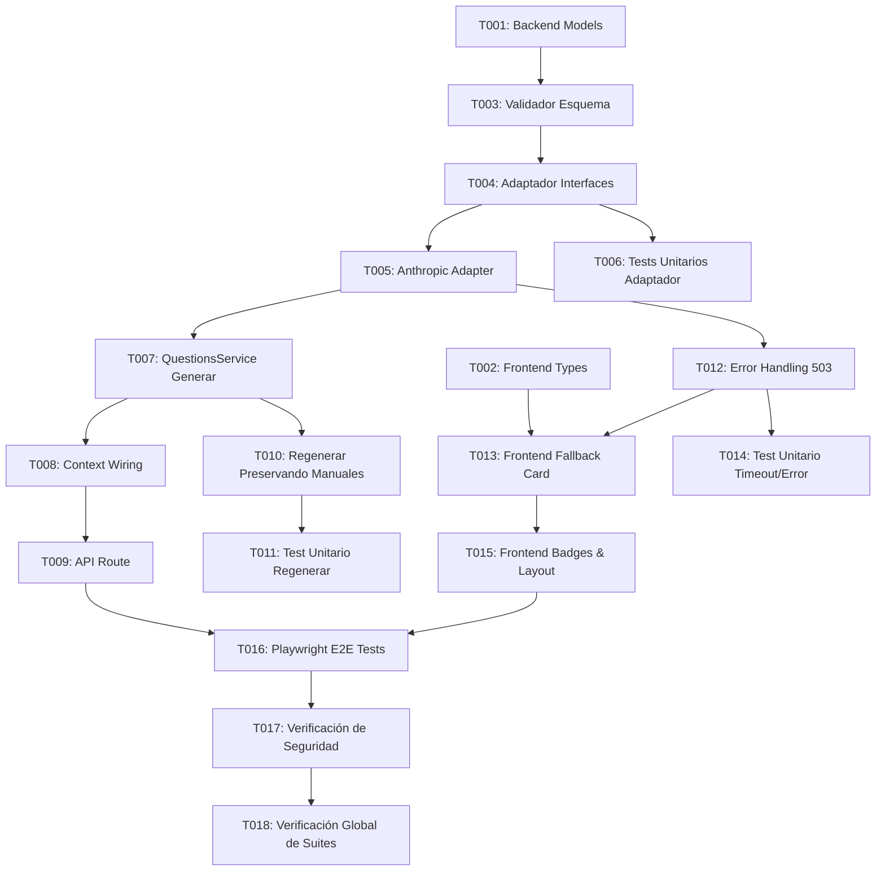

---

description: "Task list for feature 005: Generación de preguntas para sesiones con LLM"
---

# Tasks: Generación de preguntas para sesiones con LLM

**Input**: Design documents from `/specs/005-preguntas-sesion-llm/`

**Prerequisites**: plan.md (required), spec.md (required for user stories), research.md, data-model.md, contracts/

**Tests**: plan.md y research.md definen explícitamente tests unitarios en Vitest (`backend/tests/question-generation.test.ts`) para validación de esquemas y adaptadores mockeados, así como validación E2E en Playwright (`e2e/tests/preguntas.spec.ts`); se incluyen como tareas dedicadas.

**Organization**: Tareas agrupadas por historia de usuario para permitir implementación y verificación independiente de cada incremento.

## Format: `[ID] [P?] [Story] Description`

- **[P]**: Puede ejecutarse en paralelo (archivos distintos, sin dependencias pendientes)
- **[Story]**: Historia de usuario a la que pertenece (US1, US2, US3, US4)
- Cada tarea incluye la ruta de archivo exacta

## Path Conventions

Monorepo web existente (`backend/`, `frontend/`, `e2e/`); estructura de proyecto documentada en plan.md.

---

## Phase 1: Setup

**Purpose**: Actualizar los tipos de datos compartidos en backend y frontend para soportar la categorización de preguntas.

- [X] T001 [P] Actualizar tipos de dominio en `backend/src/models/index.ts` añadiendo `TipoPregunta = 'general' | 'tecnica'` y campo opcional `tipo?: TipoPregunta` en `PreguntaPreparada` (data-model.md)
- [X] T002 [P] Actualizar tipos de frontend en `frontend/src/services/types.ts` añadiendo `TipoPregunta = 'general' | 'tecnica'` y campo opcional `tipo?: TipoPregunta` en `Pregunta` (data-model.md)

**Checkpoint**: Tipos de datos sincronizados y listos.

---

## Phase 2: Foundational (Blocking Prerequisites)

**Purpose**: Definir las interfaces del adaptador de generación y las funciones de validación de esquema que requiere el servicio.

**⚠️ CRITICAL**: Todas las historias dependen de que el validador y las interfaces de generación estén definidas antes de instanciarlas en servicios y componentes.

- [X] T003 [P] Añadir validador `esPreguntasGeneradasValidas(datos: unknown): datos is RespuestaGeneracionTool` en `backend/src/models/validation.ts` asegurando array de exactamente 4 preguntas, textos no vacíos y tipos válidos (`general` o `tecnica`) (data-model.md, research.md R1, R3)
- [X] T004 [P] Definir interfaces `PreguntaGenerada`, `ContextoGeneracionPreguntas`, `RespuestaGeneracionTool` y actualizar `QuestionGenerationAdapter` y `StubQuestionGenerationAdapter` en `backend/src/integrations/question-generation.ts` para devolver 4 preguntas categorizadas (data-model.md, research.md R2, R3, R6)

**Checkpoint**: Contratos de datos de generación y validación completados.

---

## Phase 3: User Story 1 - Generar preguntas inteligentes para una sesión con LLM (Priority: P1) 🎯 MVP

**Goal**: Generar automáticamente 4 preguntas inteligentes (2 generales/estratégicas y 2 técnicas/profundas) mediante Anthropic Claude a partir del contexto enriquecido de la sesión (título, tema, ponentes, empresa, evento y objetivos).

**Independent Test**: Invocar la generación de preguntas sobre una sesión con tema y ponente y comprobar que se generan y persisten 4 preguntas estructuradas y categorizadas en `preguntas.json` (spec.md US1, quickstart.md Escenario 1).

### Implementation for User Story 1

- [X] T005 [P] [US1] Implementar `AnthropicQuestionGenerationAdapter` en `backend/src/integrations/question-generation.ts` utilizando `@anthropic-ai/sdk` con tool use forzado `generar_preguntas`, `max_tokens: 1024`, `temperature: 0.2`, timeout estricto de 15s (`AbortSignal.timeout(15_000)`) y validación con `esPreguntasGeneradasValidas` (research.md R1, R3, R4)
- [X] T006 [P] [US1] Crear suite de tests unitarios `backend/tests/question-generation.test.ts` con pruebas para `esPreguntasGeneradasValidas`, `StubQuestionGenerationAdapter` y `AnthropicQuestionGenerationAdapter` mockeando el SDK de Anthropic (plan.md, SC-004)
- [X] T007 [US1] Actualizar `QuestionsService.generar` en `backend/src/services/questions-service.ts` para recopilar el contexto de la sesión (`titulo`, `tema`, ponentes con empresa desde `repos.ponentes`, nombre del evento desde `repos.eventos` y objetivos desde `repos.perfiles_objetivos`), invocar el adaptador y persistir las 4 preguntas generadas con `tipo` y `origen: 'sugerida'` (research.md R2, R7)
- [X] T008 [US1] Actualizar `createContext` en `backend/src/context.ts` para instanciar `AnthropicQuestionGenerationAdapter` si `ANTHROPIC_API_KEY` está configurada, o `StubQuestionGenerationAdapter` si está en modo test o no hay clave (research.md R5, R6)
- [X] T009 [US1] Actualizar ruta `POST /api/events/:id/sesiones/:sesionId/preguntas/generar` en `backend/src/api/routes/sessions-questions.ts` asegurando la correcta devolución de la lista de preguntas generadas y códigos HTTP (contracts/api.md)

**Checkpoint**: Generación de preguntas con LLM completada y verificada de forma aislada.

---

## Phase 4: User Story 2 - Regenerar preguntas para explorar nuevos ángulos (Priority: P1)

**Goal**: Permitir al asistente pulsar "regenerar" para sustituir las sugerencias previas por una nueva tanda de preguntas sugeridas sin perder las preguntas manuales redactadas a mano.

**Independent Test**: Ejecutar regeneración sobre una sesión que contenga tanto preguntas sugeridas como manuales y verificar que las manuales se mantienen intactas mientras que las sugeridas se reemplazan (spec.md US2, quickstart.md Escenario 2).

### Implementation for User Story 2

- [X] T010 [US2] Asegurar en `QuestionsService.generar` (`backend/src/services/questions-service.ts`) que el borrado previo a la inserción filtre estrictamente por `sesion_id === sesionId && origen === 'sugerida'`, garantizando que las preguntas con `origen === 'manual'` nunca sean eliminadas (spec.md US2, FR-006, SC-003)
- [X] T011 [US2] Añadir test unitario en `backend/tests/question-generation.test.ts` que verifique la regeneración sucesiva de preguntas asegurando la persistencia de preguntas con `origen: 'manual'` (SC-003)

**Checkpoint**: Regeneración segura que preserva el contenido manual del usuario verificada.

---

## Phase 5: User Story 3 - Degradación controlada y fallback cuando el LLM no está disponible (Priority: P2)

**Goal**: Garantizar que ante falta de clave de API, timeouts de red o errores del proveedor, la aplicación informe con un error 503 (`servicio_ia_no_disponible`) y permita continuar añadiendo preguntas a mano sin bloquear la pantalla móvil.

**Independent Test**: Desactivar la clave o simular timeout en backend y verificar que la aplicación devuelve 503 controlado y la interfaz de usuario permite crear preguntas manuales con normalidad (spec.md US3, quickstart.md Escenario 3).

### Implementation for User Story 3

- [X] T012 [P] [US3] Manejar capturas de timeout (`AbortError`), errores de red o motor nulo en `AnthropicQuestionGenerationAdapter` y `QuestionsService` (`backend/src/services/questions-service.ts`) lanzando `ApiError(503, 'servicio_ia_no_disponible', 'No se pudieron generar preguntas en este momento')` cuando no hay datos suficientes o el servicio de IA no responde (contracts/api.md, research.md R4, R5)
- [X] T013 [P] [US3] Actualizar `frontend/src/pages/SessionQuestions.tsx` para capturar el error `servicio_ia_no_disponible` (503), mostrando una tarjeta informativa de servicio no disponible temporalmente y manteniendo completamente operativo el formulario de preguntas manuales (spec.md US3, research.md R5, R8)
- [X] T014 [US3] Añadir casos de test unitario en `backend/tests/question-generation.test.ts` que simulen timeout de 15s y respuestas de error de Anthropic comprobando que `QuestionsService` emite `ApiError` 503 controlado (SC-002)

**Checkpoint**: Resiliencia y degradación no bloqueante ante fallos de IA probada.

---

## Phase 6: User Story 4 - Coexistencia con preguntas manuales del usuario (Priority: P3)

**Goal**: Mostrar y distinguir con claridad en la vista de la sesión las preguntas sugeridas por la IA (con su categoría general o técnica) de las preguntas redactadas por el asistente ("Tuya").

**Independent Test**: Registrar preguntas manuales y sugeridas en la misma sesión y comprobar en UI y API que ambas coexisten con sus etiquetas e identificadores correspondientes (spec.md US4, quickstart.md Escenario 2 y 4).

### Implementation for User Story 4

- [X] T015 [P] [US4] Actualizar la interfaz de `frontend/src/pages/SessionQuestions.tsx` para adaptar el texto del botón principal ("Generar preguntas" si no hay sugerencias previas o "Regenerar preguntas" si ya existen) y renderizar el listado distinguiendo visualmente las sugeridas de las manuales (badge `amber` para Sugerida y `teal` para Tuya, y opcionalmente etiqueta de tipo `Estratégica` / `Técnica`) con diseño optimizado para móvil (Principio III, VIII, research.md R8)
- [X] T016 [US4] Actualizar la suite E2E en `e2e/tests/preguntas.spec.ts` para verificar el flujo completo de generación de 4 preguntas, adición de preguntas manuales, regeneración conservando las manuales y coexistencia visual (quickstart.md Escenarios 1, 2 y 4)

**Checkpoint**: Coexistencia clara y validación E2E completa.

---

## Phase 7: Polish & Cross-Cutting Concerns

**Purpose**: Verificaciones no funcionales, seguridad de credenciales y ejecución de suites completas.

- [X] T017 [P] Verificar que no se registren tokens, claves API ni prompts completos en logs de backend, cumpliendo con la política de seguridad y Principio VI (`backend/src/integrations/question-generation.ts`, `backend/src/services/questions-service.ts`) (FR-002, SC-005)
- [X] T018 Ejecutar todas las pruebas unitarias de backend (`npm --prefix backend test`) y la suite de pruebas E2E de Playwright (`npm --prefix e2e test`) para certificar cero regresiones en el flujo general (quickstart.md)

---

## Dependencies & Story Execution Order

### Story Completion Order

1. **Foundational & Setup** (Fases 1 y 2): Habilita modelos, validadores e interfaces base.
2. **User Story 1** (Fase 3 - MVP): Generación funcional con LLM real/stub contextual de 4 preguntas estructuradas.
3. **User Story 2** (Fase 4): Regeneración con borrado selectivo de sugerencias y preservación de manuales.
4. **User Story 3** (Fase 5): Degradación controlada (503) ante fallos de IA y resiliencia en frontend.
5. **User Story 4** (Fase 6): Coexistencia visual y tests E2E integrados.
6. **Polish** (Fase 7): Seguridad de logs y suite de tests en verde.

---

## Parallel Execution Opportunities

- **Fase 1 (Setup)**: `T001` (backend models) y `T002` (frontend types) pueden ejecutarse en paralelo.
- **Fase 2 (Foundational)**: `T003` (validador) y `T004` (interfaces) pueden implementarse en paralelo.
- **Fase 3 (US1)**: `T005` (Anthropic Adapter) y `T006` (Tests unitarios) pueden desarrollarse simultáneamente.
- **Fase 5 (US3)**: `T012` (backend 503 handling) y `T013` (frontend UI fallback card) pueden realizarse en paralelo.
- **Fase 6 & 7**: `T015` (frontend styling) y `T017` (security check) pueden ejecutarse en paralelo.

---

## Implementation Strategy & MVP Scope

- **MVP Target**: Completar Fases 1 a 3 (T001–T009). Con esto, la aplicación ya es capaz de sustituir el stub determinista por preguntas inteligentes contextualizadas generadas con Claude y persistidas en el backend.
- **Incremento 2**: Fases 4 y 5 (T010–T014). Añade la robustez de regeneración y la degradación controlada ante falta de conectividad o de credenciales.
- **Incremento 3**: Fases 6 y 7 (T015–T018). Afina la experiencia visual móvil y certifica la suite completa con pruebas automatizadas sin regresiones.
